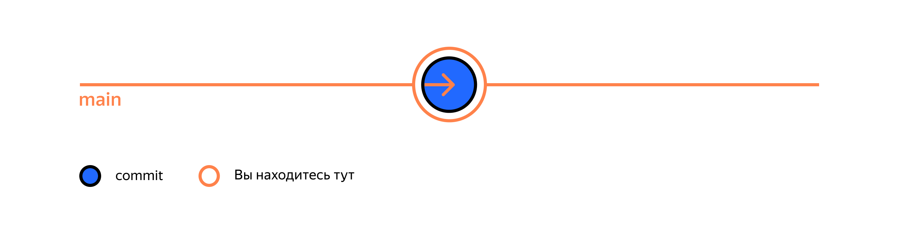
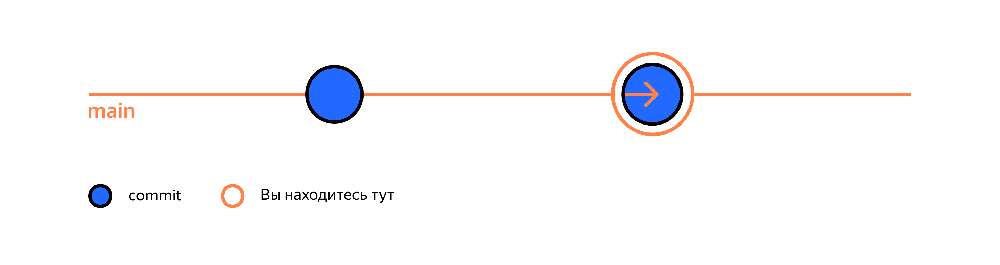
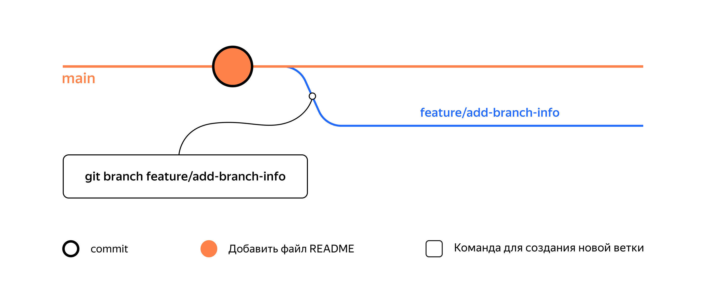
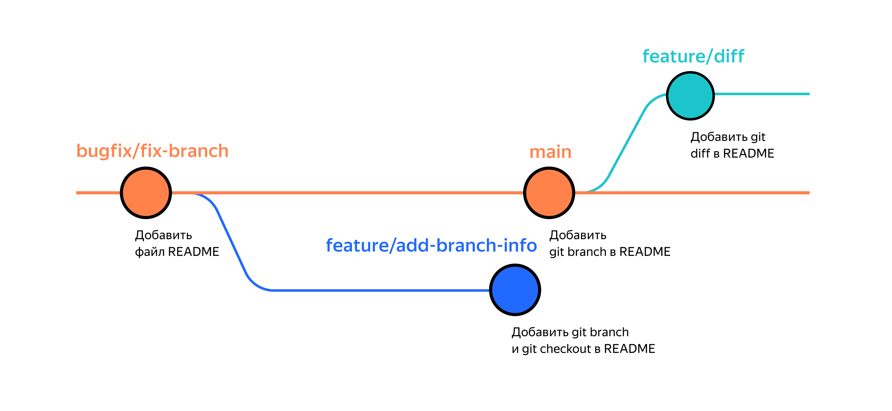
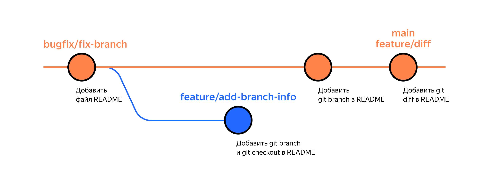

# Использование системы Git

## Команды ssh

| Команда                                | Результат выполнения |
|----------------------------------------|----------------------|
|`ssh-keygen -t ed25519 -С "github_email"`| создает пару ssh - ключей в ~/.ssh (.pub - публичный, для шифрования; без .pub - приватный, для расшифровки)|
|`ssh -T git@github.com`| позволяет проверить ключи (в разделе `settings` на github заранее необходимо добавить свой публичный ключ - содержимое .pub файла в ~/.ssh)|

## Команды git

| Команда                        | Результат выполнения |
|--------------------------------|----------------------|
|`git init`| создает репозиторий в текущем каталоге|
|`git status`| выводит статус (состояние) репозитория в текущем каталоге|
|`git add`| подготовить файл к сохранению (коммиту)|
|`git add --all`| подготовить все файлы к сохранению (коммиту)|
|`git restore --staged <file>`| переведёт файл из staged обратно в modified или untracked|
|`git restore --staged .`| «сбросить» все файлы из staged обратно в untracked/modified в текущем каталоге `.`|
|`git restore <file>`| «откатит» изменения в файле до последней сохранённой (в коммите или в staging) версии|
|`git commit -m "text"`| сделать коммит с комментарием "text"|
|`git commit --amend --no-edit`| дополнить коммит новыми файлами (работает только с последним коммитом - HEAD), опция `--no-edit` указывает о том, что сообщение коммита менять не нужно|
|`git commit --amend -m "Новое сообщение"`| изменить сообщение коммита|
|`git reset --hard <commit hash>`| «откатит» историю до коммита с хешем \<hash\>. Более поздние коммиты потеряются!|
|`git log`| вывести историю коммитов|
|`git log --oneline`| вывести краткую историю коммитов|
|`git remote add <origin> <url>`| связать репозиторий с удаленным (\<origin\> - имя удаленного, \<url\> - url к удаленному репозиторию)|
|`git remote -v`| позволяет убедиться, что локальный и удаленный репозитории связаны (-v = --verbose)|
|`git push`| отправить изменения в удаленный репозиторий|
|`git push -u origin master`| использование вышеописанной команды в первый раз (-u связывает локальную ветку с одноименной удаленной, origin - имя удаленного репозитория, master - имя ветки)|
|`git diff`| Эта команда сравнит последнюю закоммиченную версию файлов с текущей (изменённой) версией и выведет их различия.|
|`git diff --staged`| Эта команда сравнит последнюю закоммиченную версию файлов с сохраненной для коммита версией и выведет их различия.|
|`git diff <hash> <hash>`| Эта команда сравнит два коммита с указанными хэшами (можно взять их из комманды `git log --oneline`) и выведет их различия. Вместо хэша можно использовать ссылку на последний коммит - `HEAD`|

### Порядок аргументов git diff

По сути команда `git diff A B` выводит список инструкций: как превратить состояние `A` в состояние `B`. Если поменять `A` и `B` местами (`git diff B A`), то и инструкции будут обратные: как превратить `B` в `A`. При этом все зелёные строки станут красными, и наоборот.

## Жизненный цикл файла в git


## Процесс «отката» с помощью `git reset --hard <hash>`


## Игнорирование файлов в Git

В простейшем случае в `.gitignore` указывают все файлы, которые нужно игнорировать (по одному имени на строку). Но часто удобнее использовать шаблоны. Шаблон, или правило, — это способ указать сразу на несколько файлов с однотипными названиями.

### Комментарий

Если строка начинается с `#`, то это комментарий, и `.gitignore` не будет его учитывать.

### Звёздочка (`*`)

Символ звёздочки (`*`) соответствует любой строке, включая пустую. Если такой символ используется в шаблоне в `.gitignore`, значит, файл будет проигнорирован вне зависимости от того, что будет на месте звёздочки.

```bash
# игнорировать все файлы, которые заканчиваются на .jpeg
*.jpeg

# игнорировать все файлы "tmp" во всех подпапках папки docs
docs/*/tmp 
```

### Вопросительный знак (`?`)

Вопросительный знак `?` соответствует одному любому символу.

```bash
file?.txt 
```

Если сохранить такую запись в `.gitignore`, то будут проигнорированы, например, файлы `fileA.txt` и `file1.txt`. А вот файл `file12.txt` не будет проигнорирован, потому что в его названии два символа после `file`, а не один.

### Квадратные скобки (`[…]`)

Квадратные скобки, как и вопросительный знак, соответствуют одному символу. При этом символ не любой, а только из списка, который указан в скобках.

```bash
# игнорировать файлы file0.txt, file1.txt и file2.txt
# при этом не игнорировать file3.txt, file4.txt, ...
file[0-2].txt 
```

В скобках можно либо перечислить символы (`[abc]`), либо задать диапазон (`[a-z]`).

### Слеш (`/`)

Косая черта, или слеш (`/`), указывает на каталоги. Если шаблон в `.gitignore` начинается со слеша, то Git проигнорирует файлы или каталоги только в корневой директории.

```bash
# игнорировать todo.txt в корне репозитория
/todo.txt

# для сравнения: spam.txt будет игнорироваться во всех папках
spam.txt 
```

Теперь файл `todo.txt` в корневом каталоге будет проигнорирован. При этом, например, файл `subdir/todo.txt` по-прежнему отслеживается.  
Если шаблон заканчивается слешем, то правило применится только к папке.

```bash
# игнорировать папку build
build/ 
```

Если build — это папка, то она будет проигнорирована. Если build — обычный файл, то он не подпадёт под правило и не будет игнорироваться.

### Парные звёздочки (`**`)

Функция парных звёздочек (`**`) похожа на функцию одинарной (`*`). Отличие в том, как они работают с вложенными папками. Двойная звёздочка может соответствовать любому количеству таких папок (в том числе нулю). Одинарная может соответствовать только одной.

```bash
# игнорировать файлы "docs/current/tmp", "docs/old/tmp",
# а также "docs/old/saved/a/b/c/d/tmp"
# и даже "docs/tmp", потому что ноль вложенных папок тоже подходит
docs/**/tmp

# игнорировать только "docs/current/tmp" и "docs/old/tmp"
# файл "docs/old/saved/a/b/c/d/tmp" не попадает в правило
docs/*/tmp 
```

### Восклицательный знак (`!`)

Любое правило в файле `.gitignore` можно инвертировать с помощью восклицательного знака (`!`).

```bash
# игнорировать все JPEG-файлы
*.jpeg

# но только не мем с Doge
!doge.jpeg 
```

Теперь файл `doge.jpeg` будет отслеживаться, хотя остальные jpeg-файлы будут проигнорированы. Такие правила удобны для добавления исключений из других правил `.gitignore`.

### `.gitignore` и `git status`

Игнорируемые файлы не отображаются в выводе команды `git status`, иначе они бы засоряли вывод.
Если всё же нужно отобразить все игнорируемые файлы, то это можно сделать с помощью ключа `--ignored`: `git status --ignored`. В таком случае в выводе `git status` появится раздел `Ignored files`.

## Клонировать репозиторий — `git clone`

```bash
$ git clone https://github.com/yandex-praktikum/git-clone-lesson
# укажите адрес репозитория, который нужно склонировать
```

Команда `git clone` автоматически связывает локальный и удалённый репозиторий. То есть если в GitHub-репозитории что-то поменяется (например, добавятся коммиты), вам не нужно будет заново клонировать его. Достаточно будет выполнить команду, которая обновит вашу копию.
Убедитесь в том, что репозитории связаны, командой `git remote -v`.

```bash
$ cd git-clone-lesson
$ git remote -v
origin    git@github.com:yandex-praktikum/git-clone-lesson.git (fetch)
origin    git@github.com:yandex-praktikum/git-clone-lesson.git (push)
```

## Ветки проекта

`git branch` - команда для просмотра веток.  
При вызове `git branch` выводятся ветки, которые есть в проекте. Звёздочкой (`*`) отмечено, в какой ветке вы находитесь в текущий момент.

```bash
$ mkdir learn_branches && cd learn_branches && git init # создали новый репозиторий
$ touch README.md # создали файл

$ git add . # команда git add с флагом-точкой подготовит к сохранению текущую папку; вместо этого можно вызвать git add --all
$ git commit -m "Выполнить первый коммит" 

$ git branch 
* main # мы в основной ветке

# чтобы выйти из просмотра веток, может понадобиться Q!
```

Сейчас проект learn_branches выглядит так.


```bash
git add . && git commit -m "Обновить README"
```

Как и предыдущий, этот коммит сохранится внутри главной ветки. Схематически это выглядит так.


`git branch <название_ветки>` - создать ветку.

```bash
$ git branch feature/add-branch-info # создали ветку feature/add-branch-info
$ git branch # посмотрели ветки
  
  feature/add-branch-info  # появилась новая
* main                     # * значит, что мы находимся в основной ветке
```

Сейчас в репозитории две ветки — основная и `feature/add-branch-info`


`git checkout <название_ветки>` - переключиться на другую ветку

`git checkout -b <название_ветки>` - создать ветку и сразу переключиться на неё

Ветка в Git — это указатель на коммит. Когда делается новый коммит в ветке, этот указатель передвигается вперёд.

`git diff <название_ветки1> <название_ветки2>` - сравнить ветки

### Суффикс навигации `~`

Для `git diff` в `Git` есть суффикс навигации `~N`, где `N` — это число.  
Он отсчитывает от заданного коммита N коммитов назад во времени. Нумерация начинается с нуля: `commit~0` — это сам коммит, `commit~1` — предыдущий, `commit~2` — предшествующий предыдущему и так далее.
Например, `HEAD~1` — это следующий за текущим коммит. А `main~5` — это пятый коммит в ветке `main`, если считать с последнего выполненного коммита.

Или можно использовать хеши.

```bash
git diff 2ea56ab~ 2ea56ab
```

`git merge <название_ветки>` - выполнить слияние  
Перед тем как начать процесс слияния, нужно перейти в ветку, куда должны добавиться изменения. Обычно это главная ветка.

Пример:

До слияния


```bash
$ git checkout main # переключились на главную ветку

$ git merge feature/diff # объединили ветки
Updating 079cfbf..f30d441
Fast-forward
 README.md | 2 ++
 1 file changed, 2 insertions(+)
```

Объединение веток прошло успешно! Все коммиты из feature/diff добавлены в главную ветку. В сообщении после слияния содержится следующая информация:

- `Updating 079cfbf..f30d441` — значит, что коммиты c `079cfbf по f30d441` были объединены.
- `Fast-forward` — это режим слияния. Fast-forward (англ. «перемотка») значит, что итогом слияния будет линейная история коммитов. Такое происходит, когда истории двух веток находятся на одной прямой — то есть когда одна ветка продолжает историю, начатую другой, как в нашем примере.
- Информация о конкретных изменениях. В нашем примере поменялся файл `README.md` (`1 file changed`): в нём теперь две новые строки (`2 insertions(+)`).

После слияния веток `main` и `feature/diff` репозиторий перейдёт в следующее состояние.

Основная ветка и feature/diff теперь указывают на один коммит:

```bash
$ git log --oneline

f30d441 (HEAD -> main, feature/diff) Добавить описание git diff в README
079cfbf Добавить git branch в README.
7ad18bd Добавить файл README
```

`git branch -D <название_ветки>` - удалить ветку после объединения

У команды `git branch -D` есть более безопасный вариант с `флагом -d`. Он удалит ветку только если она была полностью объединена с другой — то есть если две ветки стали (или изначально были) частью одной истории. Например, если вы нечаянно создали ветку с неправильным названием, её можно удалить через `git branch -d %имя_ветки%`.
